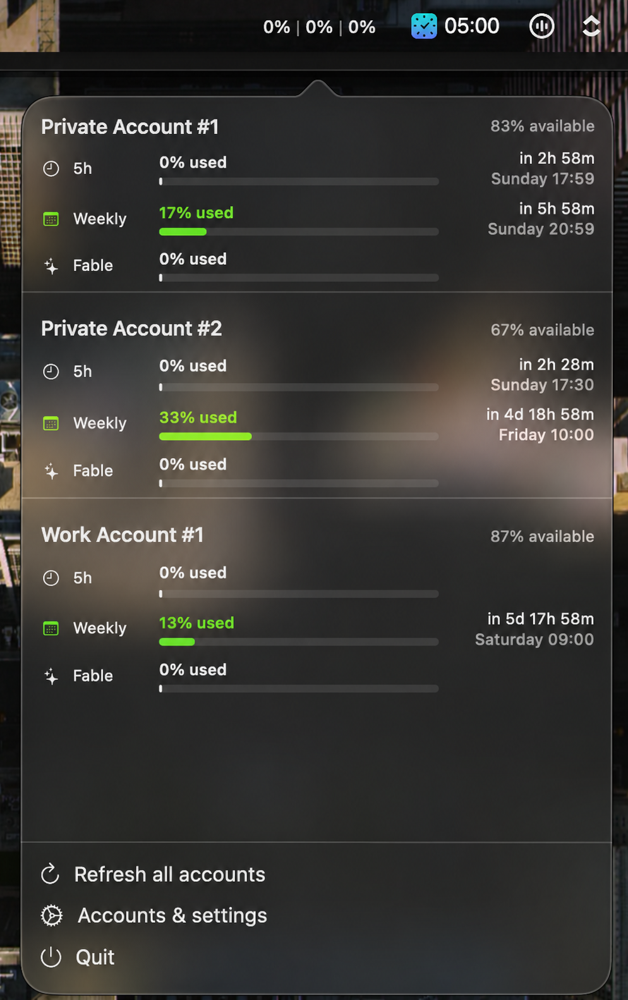

# Claude Usage Systray — Multi-Account

> **Personal-use project:** this is an unofficial community fork. It relies on undocumented Claude APIs and local Claude Code/CCS data, so some features may break or not work perfectly.

Menu-bar app for macOS that shows Claude usage across multiple accounts: 5h, weekly and Fable limits, including reset countdowns.



## Install

Download the latest `ClaudeUsageSystray-multiacc-macos.zip` from [Releases](https://github.com/theyv/claude-usage-systray-multiacc/releases), unzip it, and move `ClaudeUsageSystray.app` to `/Applications`.

The community build is ad-hoc signed, not notarized. If macOS blocks the first launch, open it from Finder with **Control-click → Open**.

## Add accounts

Open **Accounts & settings** in the app, then choose one of these:

- **Sign in with Claude Code…** — creates an isolated account profile and generates a Claude OAuth sign-in link. Use it once for each account.
- **Import CCS profiles** — automatically finds accounts managed by [CCS](https://github.com/kaitranntt/ccs).

Tokens stay in the macOS Keychain. They are never committed to this repository.

## Notes

- Requires macOS 13+ and [Claude Code](https://claude.ai/code).
- Refreshes usage every three minutes.
- This is an independent multi-account fork of [adntgv/claude-usage-systray](https://github.com/adntgv/claude-usage-systray).
- Usage data comes from an undocumented Claude endpoint and may change.

## Build from source

```bash
git clone https://github.com/theyv/claude-usage-systray-multiacc.git
cd claude-usage-systray-multiacc/claude-usage-systray
xcodebuild -scheme ClaudeUsageSystray -configuration Release build
```

## License

MIT
